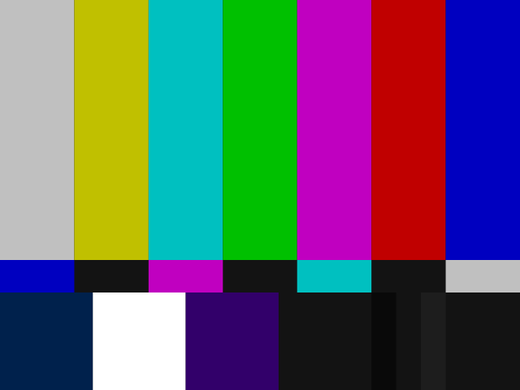
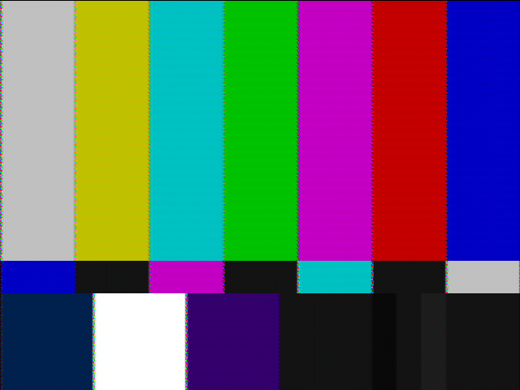
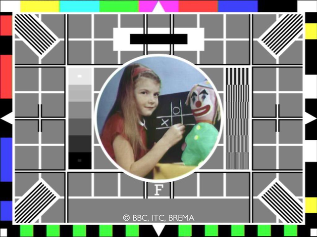
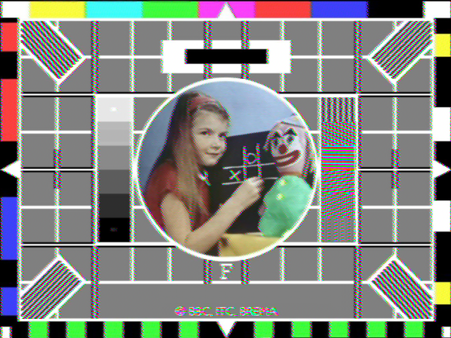
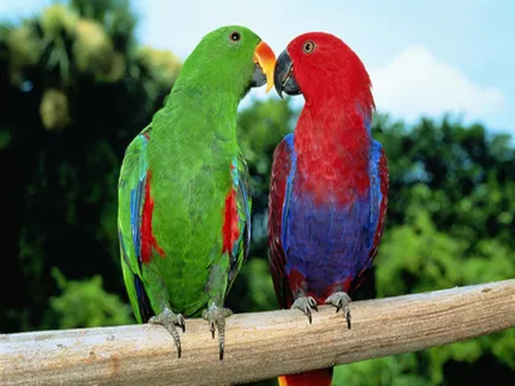
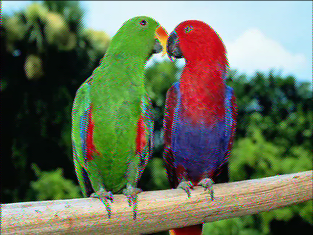

# Experiments in analogue TV encoding

This repository contains some experiments in encoding images to NTSC composite
video and decoding them again.

Source code in this repo is covered by the [licence](LICENSE.txt) unless
otherwise stated.

## Examples

