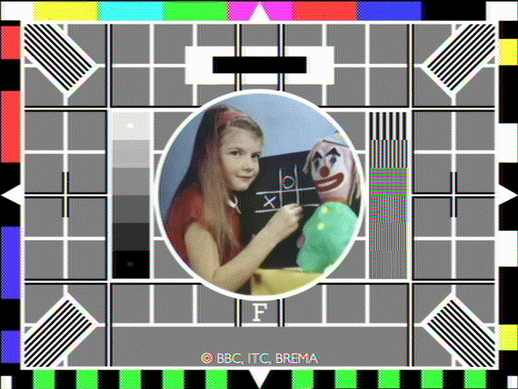

# Experiments in analogue TV encoding

This repository contains some experiments in encoding images to NTSC composite
video and decoding them again.

Source code in this repo is covered by the [licence](LICENSE.txt) unless
otherwise stated.

## Examples

Examples of input and decoded frames. Note the distinctive checkerboard
artifacts which are averaged out when viewing multiple frames. It seems Xerox
had [a patent](https://patents.google.com/patent/US6490008B1/en) on removing
them.

